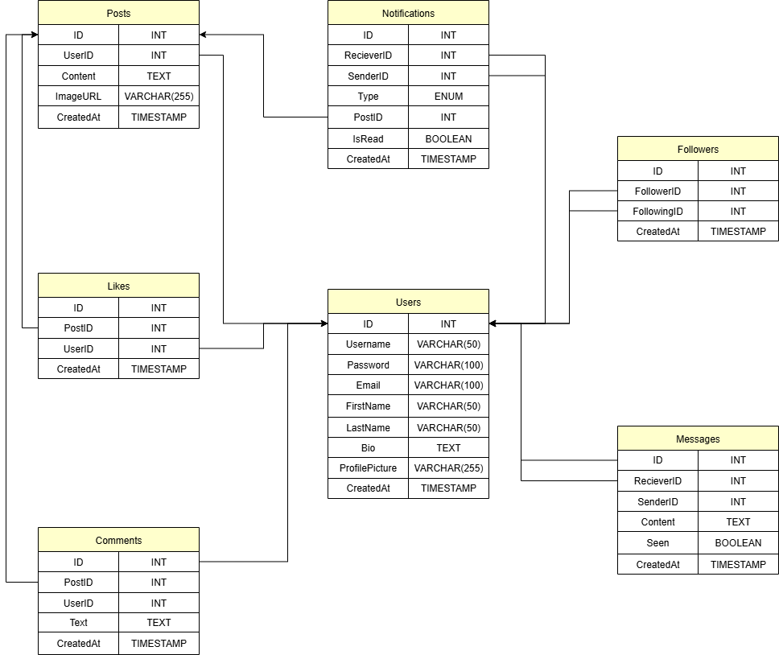
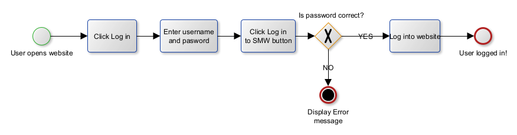
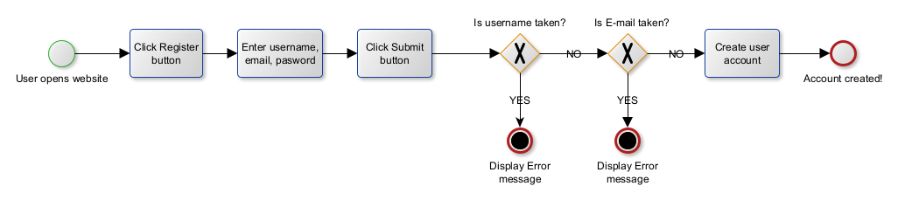
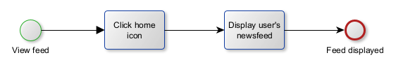
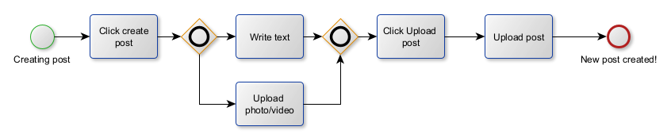
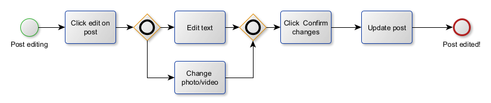
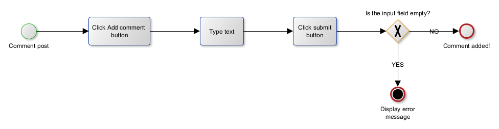
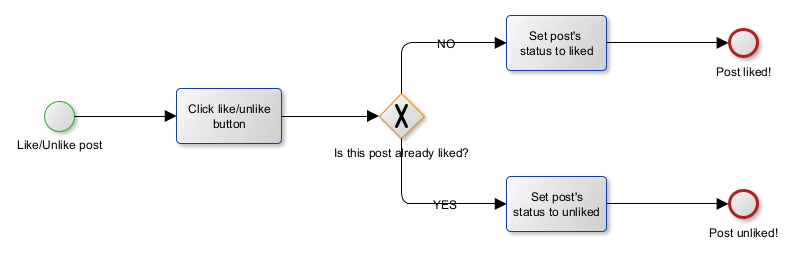

# Social Media Backend – REST API Server

## Overview
This repository contains the backend of a full-featured social media web application. It provides all server-side functionality including authentication, posts, comments, likes, follows, notifications, chat, and user profile management. The project uses a clean MVC-like structure with controllers, routes, models, middleware, and MySQL as the primary database.

This backend communicates with the React-based frontend here:
**https://github.com/danevairena/SocialMediaFrontend**

---

## Features
- 🔐 **User Authentication (JWT)**
- 👤 **User Profiles**
- 📝 **Posts** — create, edit, delete
- 💬 **Comments**
- ❤️ **Likes**
- 👥 **Follow/Unfollow System**
- 🔔 **Notifications system**
- 💬 **Chat / Messaging system**
- 🔎 **Search users**
- 📰 **Feed system** (posts from followed users)
- 🛡 **Protected routes with middleware**

---

## Tech Stack
- **Node.js**
- **Express.js**
- **MySQL**
- **JWT Authentication**
- **Multer (image upload)**
- **Bcrypt (password hashing)**
- **dotenv**
- **CORS**

---

## Project Architecture
```
/controllers
/db
/middleware
/models
/routes
/sql
/uploads
index.js
```

---

## ER Diagram
Below is the full database structure used by the backend:



---

## BPMN Process Flows
### Login


### Register


### View Feed


### New Post


### Edit Post


### Delete Post


### Comment Post


### Delete Comment


### Like / Unlike


### Follow / Unfollow


### View Profile


### Edit Profile


### Search


### Notifications


---

## Basic API Endpoints

### **Auth**
| Method | Endpoint | Description |
|--------|----------|-------------|
| POST | `/api/auth/register` | Register user |
| POST | `/api/auth/login` | Login + JWT |

### **Users**
| Method | Endpoint | Description |
|--------|----------|-------------|
| GET | `/api/users/:id` | Get user profile |
| PUT | `/api/users/:id` | Edit profile |
| PUT | `/api/users/profile-image/:id` | Upload profile image |
| GET | `/api/users/search/:query` | Search users |

### **Posts**
| Method | Endpoint | Description |
|--------|----------|-------------|
| POST | `/api/posts` | Create post |
| PUT | `/api/posts/:id` | Edit post |
| DELETE | `/api/posts/:id` | Delete post |
| GET | `/api/posts/feed/:id` | Get user feed |

### **Likes**
| Method | Endpoint | Description |
|--------|----------|-------------|
| POST | `/api/likes/:postId` | Like post |
| DELETE | `/api/likes/:postId` | Unlike post |

### **Comments**
| Method | Endpoint | Description |
|--------|----------|-------------|
| POST | `/api/comments/:postId` | Add comment |
| DELETE | `/api/comments/:commentId` | Delete comment |

### **Follow**
| Method | Endpoint | Description |
|--------|----------|-------------|
| POST | `/api/follow/:id` | Follow user |
| DELETE | `/api/follow/:id` | Unfollow user |

### **Chat**
| Method | Endpoint | Description |
|--------|----------|-------------|
| GET | `/api/chat/:userId` | Get conversation |
| POST | `/api/chat/send` | Send message |

---

## Environment Variables
Create a `.env` file in the backend root:

```
PORT=
DB_HOST=
DB_USER=
DB_PASS=
DB_NAME=
```

---

## Installation

### 1. Clone the backend
```bash
git clone https://github.com/danevairena/SocialMediaBackend.git
cd SocialMediaBackend
```

### 2. Install dependencies
```bash
npm install
```

### 3. Configure environment variables  
Create `.env` as shown above.

### 4. Import SQL  
Use any MySQL tool and import the SQL files from:
```
/sql
```

### 5. Start the server
```bash
npm start
```

---

## Folder Structure
```
/controllers   # All logic for each feature
/db            # MySQL connection
/middleware    # JWT auth checks
/models        # Database queries
/routes        # Route definitions
/sql           # Database structure
/uploads       # User uploaded images
```
